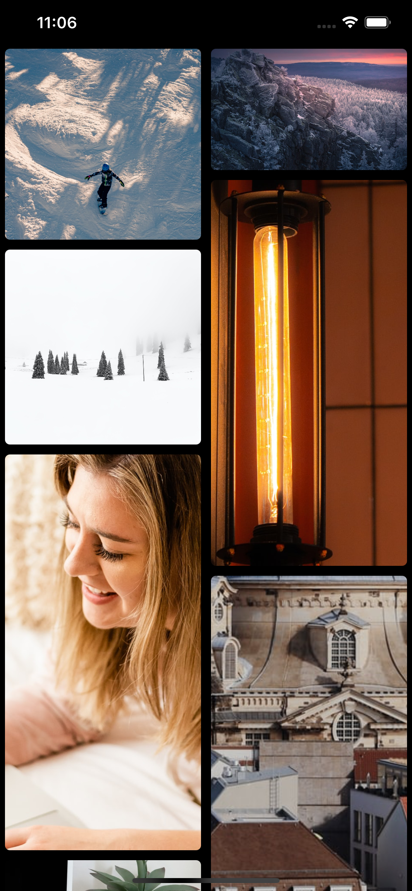

# pintrest-flow-layout
Pintrest flow layout UICollectionView

You need to adjust the coulmns number you need after setting the layout 


```
        var layout = PinterestLayout()
        collectionView = UICollectionView(frame: .zero, collectionViewLayout: layout)
        // Set columns count
        layout.columnsCount = 2
        layout.delegate = self
        layout.contentPadding = PinterestLayout.Padding(horizontal: 5, vertical: 5)
        layout.cellsPadding = PinterestLayout.Padding(horizontal: 10, vertical: 10)
```

<p align="center">
  
  
</p>
